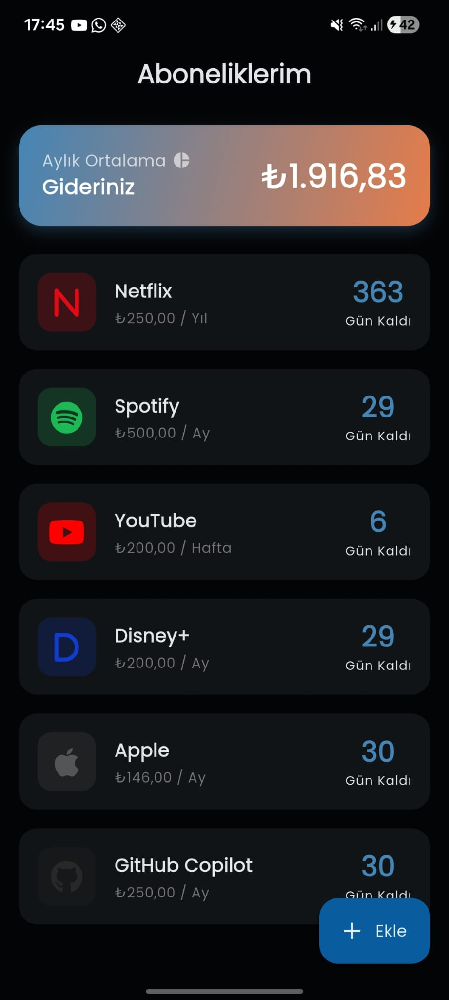
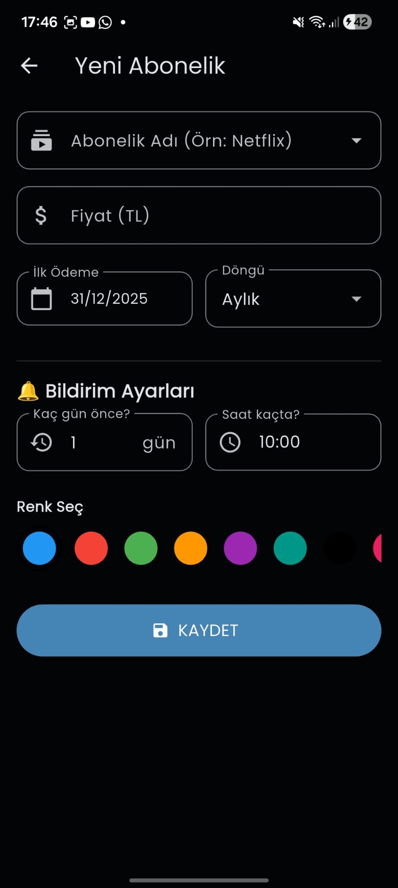
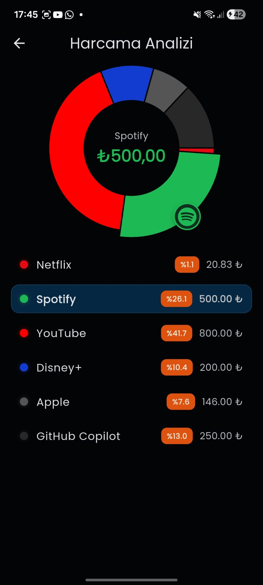

# 💸 Subby - Abonelik Takip Uygulaması

Subby, aylık, haftalık, yıllık veya günlük aboneliklerinizi takip etmenizi sağlayan, harcamalarınızı analiz eden ve ödeme günlerinden önce size özel bildirim gönderen modern bir Flutter uygulamasıdır.


## 📱 Ekran Görüntüleri

| Ana Sayfa | Ekleme Ekranı | İstatistikler |
|:---------:|:-------------:|:-------------:|
|  |  |  | 

## ✨ Özellikler

* **📊 Harcama Analizi:** Tüm aboneliklerinizi (Günlük/Haftalık/Yıllık) aylık ortalama maliyete çevirerek bütçenizi yönetmenizi sağlar.
* **🔔 Akıllı Bildirimler:** Ödeme gününden önce, istediğiniz gün ve saatte (Örn: 3 gün önce, saat 14:00'te) size hatırlatıcı bildirim gönderir.
* **🎨 Marka Algılama:** Abonelik adını (örn: Netflix, Spotify, Kira) yazdığınızda otomatik olarak kategori ikonunu ve marka rengini algılar.
* **💾 Yerel Veritabanı:** Hive kullanarak verilerinizi cihazınızda güvenle ve internet gerektirmeden saklar.
* **🌙 Dark/Light Mod:** Telefonunuzun temasına uyumlu, göz yormayan modern arayüz (FlexColorScheme).
* **📈 İnteraktif Grafikler:** Harcamalarınızın dağılımını dokunulabilir pasta grafiği ile detaylıca inceleyebilirsiniz.

## 🛠️ Kullanılan Teknolojiler ve Paketler

* **[Flutter](https://flutter.dev/):** UI Framework
* **[Hive](https://pub.dev/packages/hive):** Hafif, hızlı ve güvenli NoSQL yerel veritabanı.
* **[Flutter Local Notifications](https://pub.dev/packages/flutter_local_notifications):** Gelişmiş zamanlanmış bildirimler için.
* **[FL Chart](https://pub.dev/packages/fl_chart):** İnteraktif harcama grafikleri için.
* **[Flex Color Scheme](https://pub.dev/packages/flex_color_scheme):** Profesyonel tema ve renk yönetimi.
* **[Font Awesome](https://pub.dev/packages/font_awesome_flutter):** Geniş marka ve kategori ikon kütüphanesi.

## 🚀 Kurulum

Projeyi bilgisayarınıza indirdikten sonra terminalde sırasıyla şu komutları çalıştırın:

1.  Paketleri yükleyin:
    ```bash
    flutter pub get
    ```

2.  Hive veritabanı kodlarını oluşturun:
    ```bash
    flutter pub run build_runner build --delete-conflicting-outputs
    ```

3.  Uygulamayı çalıştırın:
    ```bash
    flutter run
    ```

## 👨‍💻 Geliştirici

**[Adınız Soyadınız]**
* GitHub: [@KullaniciAdiniz](https://github.com/KullaniciAdiniz)
* LinkedIn: [Profil Linkiniz](https://linkedin.com)

---
⭐️ Bu projeyi beğendiyseniz yıldız vermeyi unutmayın!
